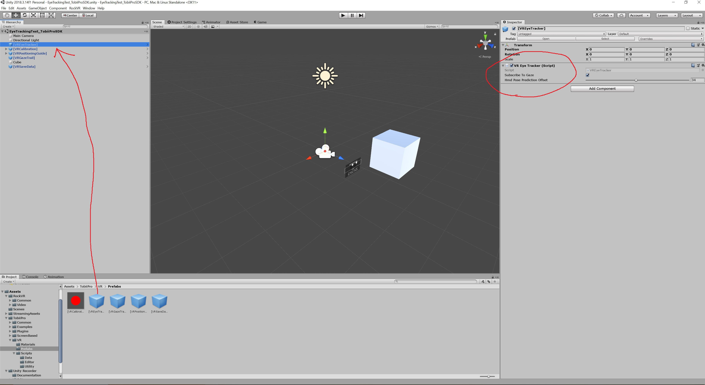
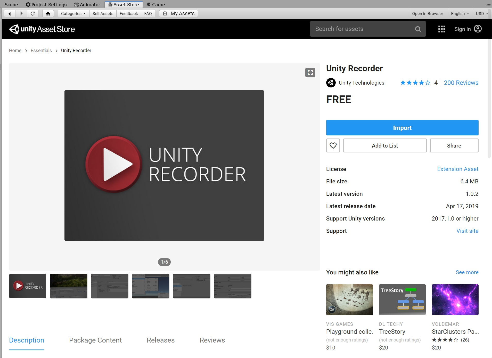
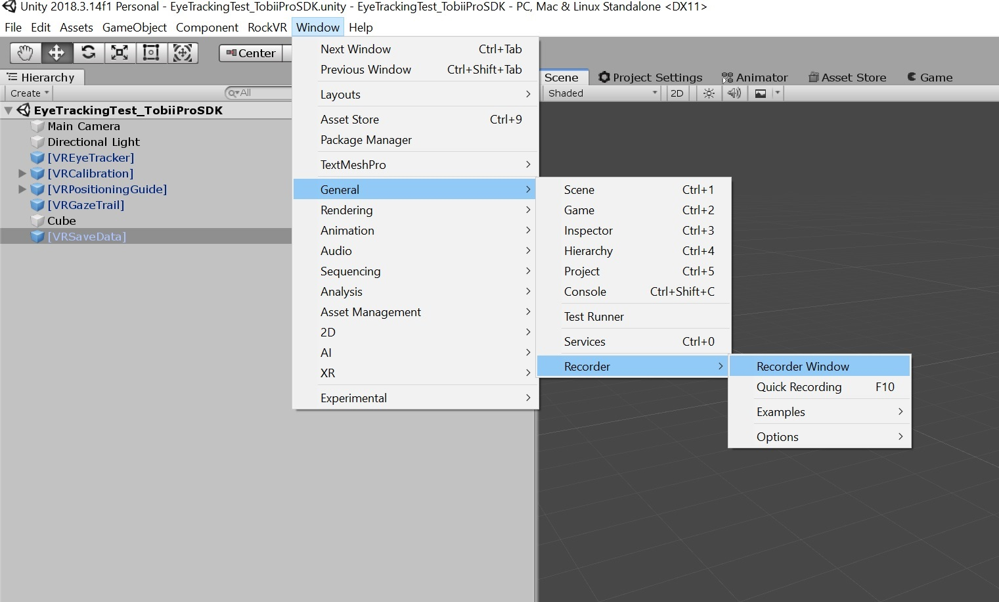
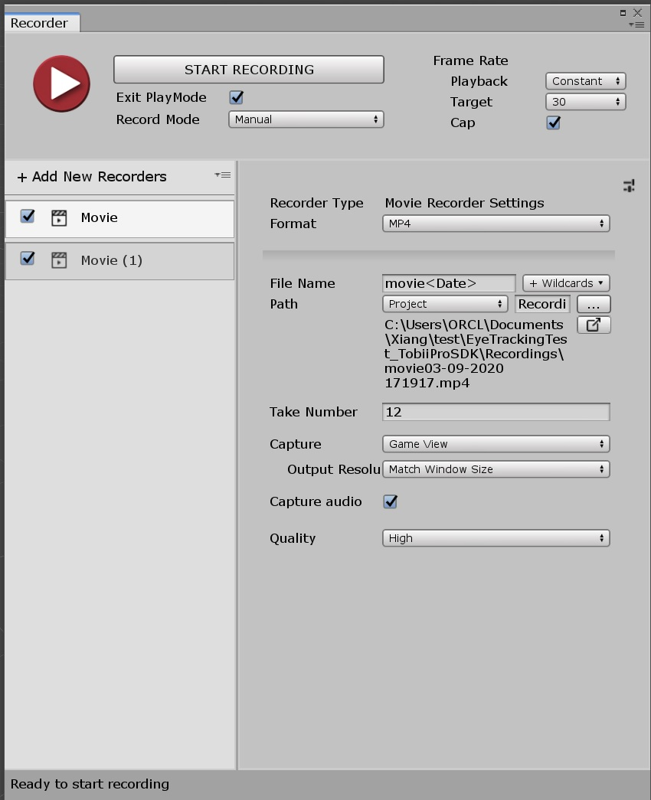

# ORCL_VR_EyeTracking
## Introduction

This repository comes with the code for Tobii Eye Tracking integrated in [HTC VIVE Eye Pro](https://www.vive.com/us/product/vive-pro/) in Unity, Which is a part of projects from Omni-Reality and Cognition Lab in University of Virginia (https://engineering.virginia.edu/omni-reality-and-cognition-lab).


## Prerequisite

1.  [HTC VIVE Eye Pro](https://www.vive.com/us/product/vive-pro/) with Tobii Eye Tracking system
2.  [Unity](https://unity.com/) version 2018.4.16 or 2018.3.14
3.  [Python](https://www.python.org/) 3.6.3 ([Anaconda](https://www.anaconda.com/) version recommended)
4.  [SteamVR](https://store.steampowered.com/steamvr) 
5.  Finish the [Set up for the HTC VIVE Eye Pro](https://enterprise.vive.com/eu/setup/vive-pro/)
6.  [Tobii Pro SDK](http://developer.tobiipro.com/index.html) for your platform

The HTC VIVE Eye Pro hardware (headset, controller) is from HTC VIVE, the integrated eye tracker is from Tobii, they have provided multiple ways to get access to the eye tracking data:

- [Tobii Pro SDK](http://developer.tobiipro.com/index.html): A general SDK for getting eye tracking data. This repository will use **Python** and **Unity** only.
- [Tobii XR SDK](https://vr.tobii.com/sdk/develop/unity/): SDK for Unity, developed by Tobii too, to get started, follow the steps in this [link](https://vr.tobii.com/sdk/develop/unity/getting-started/vive-pro-eye/). Tobii XR requires a analytical license to get the raw data, otherwise, eye tracking can only be used for interactive use.
- [Vive Eye Tracking SDK](https://developer.vive.com/resources/knowledgebase/vive-sranipal-sdk/) : SDK for eye tracking from HTC. The forum for it can be found [here](https://forum.vive.com/forum/78-vive-eye-tracking-sdk/).

This repository includes sample code and tutorials for Python and Unity  API of **Tobii Pro SDK** only.


## Tobii Pro SDK data collection

Website of Tobii Pro SDK: http://developer.tobiipro.com/index.html

You can either use Python API or Unity API to get the eye tracking data.

### Python API

Set up Python API as http://developer.tobiipro.com/python/python-getting-started.html. 

Then run the [TobiiEyeTracking.py](TobiiEyeTracking.py) in the repository to collect the data externally (not within Unity).

If an eye tracker is successfully found, the data collecting is on going until the key 'q' is pressed (you can also change it to another key in the code). An output .csv data file (name with the start and end time like [sample_output](Data\EyeTrakcing\TobiiProPython\1575497434.5828066-1575497439.7218742.csv)) will be exported into the *out_dir* defined in the code. 

```python
output_dir = 'C:/github/ORCL_VR_EyeTracking/Data/EyeTrakcing/TobiiProPython'
```

 ### Unity SDK

To start with, read the document from Tobii Pro SDK (http://developer.tobiipro.com/unity.html) and download the [Tobii Pro SDK for Unity](https://www.tobiipro.com/product-listing/tobii-pro-sdk/#Download).

1. Create a new project, or open an existing project, in Unity.

2. Select *Assets > Import Package > Custom Package...* from the main menu, or by right-clicking in the Project window.

3. Browse to the downloaded Tobii Pro SDK, named with TobiiPro.SDK.Unity.Windows.

4. In the next dialog, select to import all files.

5. In the project window, Drag and drop the "TobiiPro\VR\Prefabs\[VREyeTracker]" prefab into the scene and in the inspector, select '**Subscribe To Gaze**'. 

6. (*Not required*) Drag and drop the "TobiiPro\VR\Prefabs\[VRCalibration]" prefab into the scene. Select the [VRCalibration] prefab and in the inspector, select a key to be used to start a calibration.

7. Drag and drop the "TobiiPro\VR\Prefabs\[VRSaveData]" prefab into the scene. Select the [VRSaveData] prefab and in the inspector, select a key to be used to start and stop saving data, select 'Save Data/Save Unity Data/Save Raw Data'. 

8. Play the scene, the saved **XML data** can be found in the "**Data**" folder in the project root. Press the save data key selected earlier to stop and save data.

   More details can be found in the [readme.txt](readme.txt) in this repository.

If a XML data was created without any recorded data, check in the windows system 'Task manager' - 'Services' - 'Tobii Service' to see if it is running or not, try to restart it and collect data again.

## Video Recording

 In the asset store of Unity, search for "**Unity Recorder**", download and import. This is a free library for recording user game.



Select *Window > General > Recorder > Recorder Window* from the main menu,




After setting the Recorder, press 'START RECORDING', or you may press 'F10' in the keyboard for quick start.



Since we have already set for VR eye tracking data saving, the data collecting process will start at the same time. The saved **MP4 data** can be found in the "**Recordings**" folder in the project root.

So far, we have already set up everything for data collection. For your convenience, I also upload a sample scene for the whole process, the Google Drive Link to it is [here](https://drive.google.com/open?id=19ZlllVUZl2mWyRrg6JSof5vrMZ5ZkCz5).


## Process Eye Tracking Data

Suppose we have XML data collected in "**Data**" folder in the project root as what I have in the '\Data\EyeTrakcing\TobiiProUnity' folder in the repository, and the videos collected in the "**Recordings**" folder in the project root as what we have in the '\Data\Video\OriginalVideo' folder in the repository. The goal of this part is to map the gaze data to the videos. 

The three python scripts under 'EyeTrackingProcess' folder provides a workflow of processing eye tracking data. 

- [0.video2pic.py](EyeTrackingProcess/0.video2pic.py) Extract frame images from the videos.
- [1.ReadingTxtFile.py](EyeTrackingProcess/1.ReadingTxtFile.py) reads the XML file and reshape it to a more readable .csv file.
- [2.PlotEyeTrackingOnImgs.py](EyeTrackingProcess/2.PlotEyeTrackingOnImgs.py) reads the .csv file from last step and try to map them in the corresponding video frames and write the images (**NOTE**: the coordinate systems of the raw eye tracking and the videos are not correctly matched). Please refer to '*Useful tips and hints*' on the bottom of this [page](http://developer.tobiipro.com/unity/unity-getting-started.html) and this [page](http://developer.tobiipro.com/commonconcepts/coordinatesystems.html) for more details. **If you know how to match these two systems, please Contribute to Processing with Pull Requests!!!!! Thank you!**
- [3.Img2video.py](EyeTrackingProcess/3.Img2video.py) collects all the images and convert them back to a video with gaze like the sample output video in '\Data\Video\GazeVideo\movie01-25-2020 203114.mp4'.


