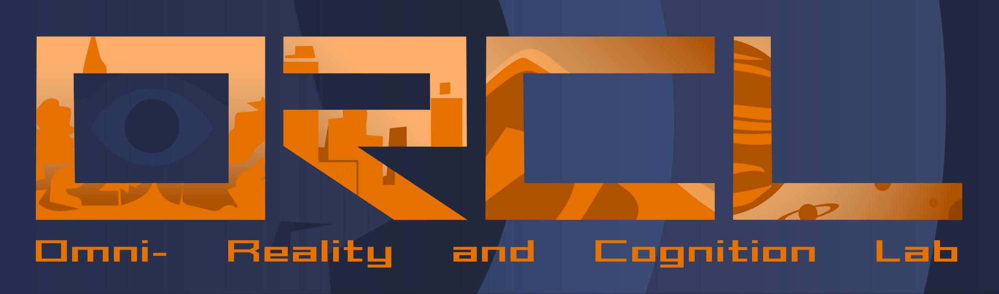
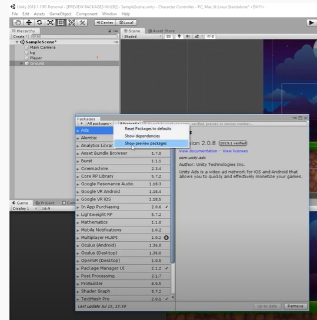
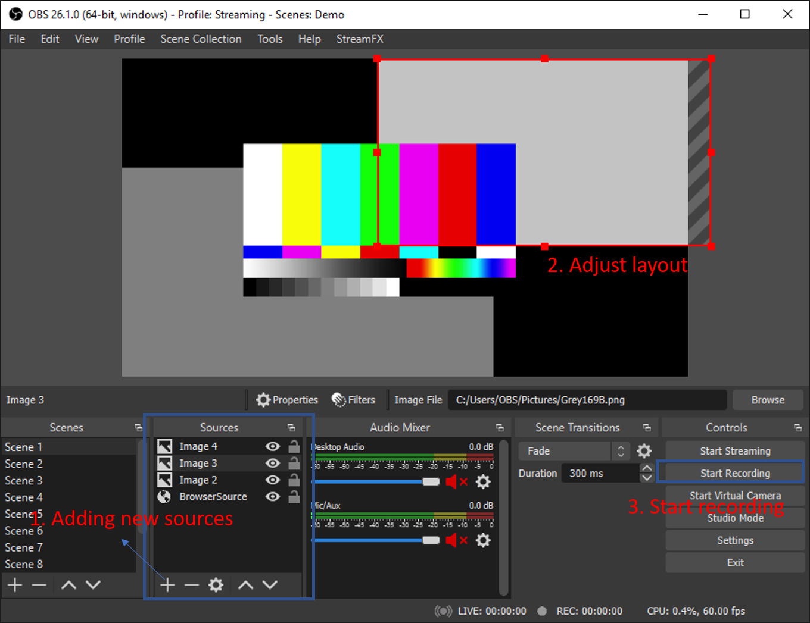

# ORCL_Sim - A System Architecture for Studying Bicyclist and Pedestrian Physiological Behavior Through Immersive Virtual Environments


## Introduction

This repository comes with the code for Tobii Eye Tracking integrated in [HTC VIVE Eye Pro](https://enterprise.vive.com/us/product/vive-pro-eye/) in Unity, Which is a part of projects from Omni-Reality and Cognition Lab in University of Virginia (https://engineering.virginia.edu/omni-reality-and-cognition-lab). More details and visualizations of our projects can be found in (http://uvabrainlab.com/portfolio/mobility-and-infrastructure-design/)



## **IMPORTANT UPDATE** 
Tobii Pro SDK In version 1.9 the VR support was deprecated.https://developer.tobiipro.com/unity/unity-getting-started.html

In order to make everything work, you may download our test scene with compatible Tobii Pro SDK version integrated [here](https://drive.google.com/open?id=19ZlllVUZl2mWyRrg6JSof5vrMZ5ZkCz5). If you choose to use our test scene, please skip the Tobii SDK Pro set up steps (other steps are still necessary).

## Prerequisite

1.  [HTC VIVE Eye Pro](https://www.vive.com/us/product/vive-pro/) with Tobii Eye Tracking system
2.  [Unity](https://unity.com/) version 2018.4.16 or 2018.3.14
3.  [Python](https://www.python.org/) 3.6.3 ([Anaconda](https://www.anaconda.com/) version recommended)
4.  [SteamVR](https://store.steampowered.com/steamvr) 
5.  Finish the [Set up for the HTC VIVE Eye Pro](https://enterprise.vive.com/eu/setup/vive-pro/)
6.  [Tobii Pro SDK](http://developer.tobiipro.com/index.html) for your platform
7.  Set up Eye Tracking Software ([SR runtime](https://www.vive.com/us/support/vive-pro-eye/category_howto/installing-eye-tracking-software.html)) if needed

The HTC VIVE Eye Pro hardware (headset, controller) is from HTC VIVE, the integrated eye tracker is from Tobii, they have provided multiple ways to get access to the eye tracking data:

- [Tobii Pro SDK](http://developer.tobiipro.com/index.html): A general SDK for getting eye tracking data. This repository will use **Python** and **Unity** only.
- [Tobii XR SDK](https://vr.tobii.com/sdk/develop/unity/): SDK for Unity, developed by Tobii too, to get started, follow the steps in this [link](https://vr.tobii.com/sdk/develop/unity/getting-started/vive-pro-eye/). Tobii XR requires a analytical license to get the raw data, otherwise, eye tracking can only be used for interactive use.
- [Vive Eye Tracking SDK](https://developer.vive.com/resources/knowledgebase/vive-sranipal-sdk/) : SDK for eye tracking from HTC. The forum for it can be found [here](https://forum.vive.com/forum/78-vive-eye-tracking-sdk/).

This repository includes sample code and tutorials for Python and Unity  API of **Tobii Pro SDK** only.


## Tobii Pro SDK data collection

Website of Tobii Pro SDK: http://developer.tobiipro.com/index.html

You can either use Python API or Unity API to get the eye tracking data.

### Python API

Set up Python API as http://developer.tobiipro.com/python/python-getting-started.html. 

Then run the [TobiiEyeTracking.py](TobiiEyeTracking.py) in the repository to collect the data externally (not within Unity).

If an eye tracker is successfully found, the data collecting is on going until the key 'q' is pressed (you can also change it to another key in the code). An output .csv data file (name with the start and end time like [sample_output](https://github.com/XiangGuo1992/ORCL_VR_EyeTracking/blob/master/Data/EyeTrakcing/TobiiProPython/1575497434.5828066-1575497439.7218742.csv)) will be exported into the *out_dir* defined in the code. 

```python
output_dir = 'C:/github/ORCL_VR_EyeTracking/Data/EyeTrakcing/TobiiProPython'
```

 ### Unity SDK (PREFERRED METHODS)

To start with, read the document from Tobii Pro SDK (http://developer.tobiipro.com/unity.html) and download the [Tobii Pro SDK for Unity](https://www.tobiipro.com/product-listing/tobii-pro-sdk/#Download).

1. Create a new project, or open an existing project, in Unity.

2. Select *Assets > Import Package > Custom Package...* from the main menu, or by right-clicking in the Project window.

3. Browse to the downloaded Tobii Pro SDK, named with TobiiPro.SDK.Unity.Windows.

4. In the next dialog, select to import all files.

5. In the project window, Drag and drop the "TobiiPro\VR\Prefabs\[VREyeTracker]" prefab into the scene and in the inspector, select '**Subscribe To Gaze**'. 

6. (*Not required*) Drag and drop the "TobiiPro\VR\Prefabs\[VRCalibration]" prefab into the scene. Select the [VRCalibration] prefab and in the inspector, select a key to be used to start a calibration.

7. Drag and drop the "TobiiPro\VR\Prefabs\[VRSaveData]" prefab into the scene. Select the [VRSaveData] prefab and in the inspector, select a key to be used to start and stop saving data, select 'Save Data/Save Unity Data/Save Raw Data'. 

8. Save the current project.

9. Play the scene, the saved **XML data** can be found in the "**Data**" folder in the project root. Press the save data key selected earlier to stop and save data.

   More details can be found in the [TobiiProVR_readme.txt](TobiiProVR_readme.txt) in this repository.

<del>If a XML data was created without any recorded data, check in the windows system 'Task manager' - 'Services' - 'Tobii Service' to see if it is running or not, try to restart it and collect data again.</del>

**2021.05.24 update**: The correct experimental order is:

1. Connect VIVE Pro Eye to your computer(in our case we have wireless connection), open VIVE wireless and SteamVR;
2. Run room setup, make sure the controllers and headsets are in the right place;
3. Run [eye calibration](https://developer.vive.com/us/support/sdk/category_howto/how-to-calibrate-eye-tracking.html#:~:text=Connect%20VIVE%20Pro%20Eye%20to%20your%20computer.%20Turn,the%20IPD.%20Follow%20the%20dot%20with%20your%20eyes) in HTC VIVE PRO EYE; 
4. Open Unity scenarios;
5. **Start or Restart** the **SR runtime software** right before playing the scene, this can ensure the data collection is working in case you have empty XML data;
6. Play the scene in Unity;
7. Stop the scene to see if all the data are collected

## Video Recording

Their are two ways to do the video recording: **External screen recording** or **internal Unity Recorder**.

### Internal Unity Recorder

Different versions of Unity requires different actions. 

For **Unity 2018**, in the asset store of Unity, search for "**Unity Recorder**", download and import. This is a free library for recording user game.


In Unity 2019 or newer, the Unity Recorder can be found in **Package Manager**. Go to '**Window**' - '**Package** **Manager**', click 'advance' - 'show preview packages', find the 'Unity Recorder', install. 

 

After import or install Unity Recorder, select *Window > General > Recorder > Recorder Window* from the main menu,


After setting the Recorder, press 'START RECORDING', or you may press 'F10' in the keyboard for quick start. **The Frame rate is suggested to  24**. 


Since we have already set for VR eye tracking data saving, the data collecting process will start at the same time. The saved **MP4 data** can be found in the "**Recordings**" folder in the project root.

The advantage of this method is that the Unity recorder will record exact every frame in the scene, however, as the frame rate of Unity during game playing is not fixed, but the video has a pre-defined fixed frame rate, it would be difficult to extract the timestamp of the experiment. For example, if the frame rate of Unity Recorder is set to 30Hz, and the actual game frame rate is ~15Hz, then the output video length will be half of the actual length. Up to 2021.1, there has been a valid solution for this issue.

### External screen recording 

Many software can be used for screen recording, we use [OBS studio](https://obsproject.com/) in our study. In SteamVR, select '**Display VR view**', drag and maximize the VR view window to an idle display, then open OBS studio, add this display as a new source, as indicated in the figure below. More settings(canvas size, frequency, file names) can be found in the 'settings' option.

The advantage of the this method is that it can integrate different video collection systems(e.g. room cameras) with the same timestamp and frequency as shown with our lab case below.


A sample video in youtube about our experiment:
[Pedestrian crossing using smartphone app](https://www.youtube.com/watch?v=Q_LUoIZuPKs) 

## Sample scene

So far, we have already set up everything for data collection. For your convenience, I also upload a sample Unity scene for the whole process, the Google Drive Link to it is [here](https://drive.google.com/open?id=19ZlllVUZl2mWyRrg6JSof5vrMZ5ZkCz5).

## Process Eye Tracking Data

Suppose we have XML data collected in "**Data**" folder in the project root as what I have in the '\Data\EyeTrakcing\TobiiProUnity' folder in the repository, and the videos collected in the "**Recordings**" folder in the project root as what we have in the '\Data\Video\1.Raw Videos' folder in the repository. The goal of this part is to map the gaze data to the videos. 

The three python scripts under 'EyeTrackingProcess' folder provides a workflow of processing eye tracking data. 

- [0.video2pic.py](EyeTrackingProcess/0.video2pic.py) Extract frame images from the videos.
- [1.ReadingTxtFile.py](EyeTrackingProcess/1.ReadingTxtFile.py) reads the XML file and reshape it to a more readable .csv file.
- [2.PlotEyeTrackingOnImgs.py](EyeTrackingProcess/2.PlotEyeTrackingOnImgs.py) reads the .csv file from last step and try to map them in the corresponding video frames and write the images. For more information about the coordinate systems, please refer to '*Useful tips and hints*' on the bottom of this [page](http://developer.tobiipro.com/unity/unity-getting-started.html) and this [page](http://developer.tobiipro.com/commonconcepts/coordinatesystems.html) for more details. <s>**Note**: the frame rate of the Unity Recorder should be set to **24**, otherwise there might be problems for this script (like 30FPS, other frame rate hasn't be tested).</s> If you are using external video recording methos such as OBS studio, you need to crop the video into separate videos first.
- [3.Img2video.py](EyeTrackingProcess/3.Img2video.py) collects all the images and convert them back to a video with gaze like the sample output video in '\Data\Video\4.Gazevideos_out\movie2020-08-2818h08m.mp4'.


## Citation
If you want to explore more details or find the repo is useful, please cite our work https://arxiv.org/abs/2112.03420 and https://engrxiv.org/mrxgh/.
```tex
 @article{guo2021orclsim,
  title={ORCLSim: A System Architecture for Studying Bicyclist and Pedestrian Physiological Behavior Through Immersive Virtual Environments},
  author={Guo, Xiang and Angulo, Austin and Robartes, Erin and Chen, T Donna and Heydarian, Arsalan},
  journal={arXiv preprint arXiv:2112.03420},
  year={2021}
}


 @misc{guo_robartes_angulo_chen_heydarian_2021,
  title={Benchmarking the Use of Immersive Virtual Bike Simulators for Understanding Cyclist Behaviors},
  url={engrxiv.org/mrxgh},
  DOI={10.31224/osf.io/mrxgh},
  publisher={engrXiv},
  author={Guo, Xiang and Robartes, Erin M and Angulo, Austin and Chen, T. D and Heydarian, Arsalan},
  year={2021},
  month={Jul}
 }
 

```


